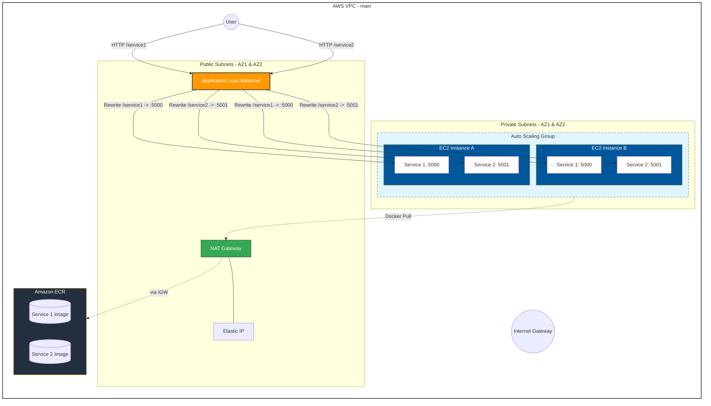

# Terraform AWS Validated Compute Stack

A professional-grade Infrastructure-as-Code (IaC) project provisioning a secure, scalable microservices environment on AWS. This project demonstrates end-to-end automation, from network isolation to automated post-deployment validation.


## 🚀 Overview

This repository automates the deployment of a containerized application stack. It utilizes a "Security-First" architecture, placing compute resources in private subnets while exposing services through an Application Load Balancer (ALB) with path-based routing and URL rewrites.

### Key Features
* **Infrastructure as Code:** 100% automated provisioning using Terraform.
* **Network Isolation:** EC2 instances reside in private subnets; outbound traffic is managed via a NAT Gateway.
* **Path-Based Routing:** ALB listener rules route traffic to specific services (e.g., `/service1`) with automatic prefix stripping.
* **Automated Quality Gate:** Integrated Python validation script (`validate_endpoints.py`) that checks service health, Prometheus metrics, and ASG status post-apply.
* **Secure Access:** Zero-trust approach using AWS Systems Manager (SSM) for instance access instead of traditional SSH/PEM keys.

---

## 🛠 Tech Stack

| Category | Technology |
| :--- | :--- |
| **Cloud Provider** | Amazon Web Services (AWS) |
| **IaC** | Terraform |
| **Containers** | Docker, Docker Compose |
| **Validation** | Python 3.x (Boto3, Requests) |
| **OS** | Ubuntu 24.04 LTS |

---

## 📐 Architecture

The architecture follows AWS best practices for high availability and security:
1.  **VPC:** Multi-AZ deployment across Public and Private subnets.
2.  **Compute:** Auto Scaling Group (ASG) ensuring a desired capacity of 2 `t2.micro` instances.
3.  **Ingress:** Internet-facing ALB acting as the single entry point.
4.  **Security Groups:** Strictly defined ingress/egress rules allowing only necessary traffic.

---


* Below is the architecture diagram


## 🚦 Getting Started

### Prerequisites
* [Terraform](https://www.terraform.io/downloads) installed.
* [Python 3.10+](https://www.python.org/downloads/) installed.
* AWS CLI configured with appropriate credentials.
* Required Python packages:
    ```powershell
    pip install requests boto3
    ```

### Deployment
1.  **Clone the repository:**
    ```bash
    git clone https://github.com/jpranay08/terraform-aws-validated-compute.git
    cd terraform-aws-validated-compute
    ```

2.  **Initialize Terraform:**
    ```bash
    terraform init
    ```

3.  **Deploy the Infrastructure:**
    ```bash
    terraform apply -auto-approve
    ```
    *Note: Upon completion, the `local-exec` provisioner will automatically trigger the Python validation script.*

---

## 🧪 Validation Logic

The project includes a robust validation suite (`validate_endpoints.py`) that ensures the infrastructure is not just "running" but "functional."

**The script performs the following checks:**
1.  **ALB Warm-up:** Retries connection until the ALB is active and targets are healthy.
2.  **Health Endpoints:** Verifies `HTTP 200` and "healthy" status on `/service1/health` and `/service2/health`.
3.  **Metrics Parsing:** Scans `/metrics` for Prometheus counters to ensure the application logic is executing.
4.  **Infrastructure State:** Uses Boto3 to verify that the Auto Scaling Group has the minimum required number of healthy instances.

---

## 🔐 Security
* **No SSH Keys:** Access to instances is handled via AWS SSM.
* **State Management:** Recommended to use a remote S3 backend with DynamoDB locking for production.
* **Secrets:** No sensitive data is hardcoded; all configuration is handled via Terraform variables.

